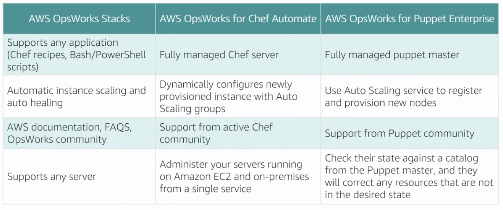

# Configuration Management and Infrastructure as Code

## CloudFormation

- template sections
  - parameters
    - pseudo parameters: AWS::AccountId, AWS::Region, AWS::StackId, etc
  - mappings
  - conditions
  - resources
  - outputs
- [how to use change sets](https://docs.aws.amazon.com/AWSCloudFormation/latest/UserGuide/using-cfn-updating-stacks-changesets.html)
  - when an stack update is run, all change sets are deleted as they are no longer valid
- [how CF handles updates](https://docs.aws.amazon.com/AWSCloudFormation/latest/UserGuide/using-cfn-updating-stacks-update-behaviors.html)
  - updates with no interruption: cloudwatch metric tweak
  - updates with some interruption: EC2 instance resize
  - replacement: new physical ID, i.e. RDS MySQL to Postgres
- stack policies
  - protect how and what is updated in a stack
  - IAM policy format
  - open by default, but if stack policy present then default switches to deny
- custom resource workflow
  - either invokes Lambda or publishes SNS
  - response token used to put result
- StackSets
  - management of duplicate stacks across regions and accounts (just now AWS organization wide)
- helper scripts
  - [`cfn-init`](https://docs.aws.amazon.com/AWSCloudFormation/latest/UserGuide/cfn-init.html): executes CloudFormation metadata one time, typically called in user data
  - [`cfn-hup`](https://docs.aws.amazon.com/AWSCloudFormation/latest/UserGuide/cfn-hup.html): monitors CloudFormation metadata and applies changes when discovered
    - `cfn-hup.conf` file lets you specify the refresh interval, default 15 minutes
    - `hooks.conf` file or `hooks.d` directory lets you trigger local commands when the resource lifecycle hits certain stages
  - [`cfn-signal`](https://docs.aws.amazon.com/AWSCloudFormation/latest/UserGuide/cfn-signal.html): provides a completion signal to designate the creation (successful or not) of a CreationPolicy or WaitCondition
  - [`cfn-get-metadata`](https://docs.aws.amazon.com/AWSCloudFormation/latest/UserGuide/cfn-get-metadata.html): view current metadata stored within the CF stack (not much exam coverage)
- [EC2 initialization metadata](https://docs.aws.amazon.com/AWSCloudFormation/latest/UserGuide/aws-resource-init.html)
  - utilized by `cfn-init` helper script
  - sections: packages, groups, users, sources, files, commands, and then services
- deploying with CloudFormation
  - deploy with CI/CD pipeline
  - can create pipeline, OpsWorks, or Elastic Beanstalk
- security
  - [audit logging with CloudTrail](https://docs.aws.amazon.com/AWSCloudFormation/latest/UserGuide/cfn-api-logging-cloudtrail.html)
    - CloudWatch events generic [rule](https://docs.aws.amazon.com/es_es/AmazonCloudWatch/latest/events/Create-CloudWatch-Events-CloudTrail-Rule.html) for API calls via CloudTrail
    - could potentially be filtered more to get API calls done by the service CloudFormation
  - CloudFormation by default uses temporary credentials generated off of the user session, but can also be configured to use a [service role](https://docs.aws.amazon.com/AWSCloudFormation/latest/UserGuide/using-iam-servicerole.html) instead

### CloudFormation Resource Attributes

- [`CreationPolicy`](https://docs.aws.amazon.com/AWSCloudFormation/latest/UserGuide/aws-attribute-creationpolicy.html)
  - pauses CloudFormation execution until a signal is received
  - can be used to ensure software is installed on an EC2 instance
  - use cfn-signal or the SignalResource api
  - supported resources: EC2, ASG, [CloudFormation WaitCondition](https://docs.aws.amazon.com/AWSCloudFormation/latest/UserGuide/aws-properties-waitcondition.html)
    - > For Amazon EC2 and Auto Scaling resources, we recommend that you use a CreationPolicy attribute instead of wait conditions. Add a CreationPolicy attribute to those resources, and use the cfn-signal helper script to signal when an instance creation process has completed successfully.
- [`DeletionPolicy`](https://docs.aws.amazon.com/AWSCloudFormation/latest/UserGuide/aws-attribute-deletionpolicy.html)
  - preserves or (in some cases) backs up a resource when its stack is deleted
  - `Retain`
    - stack deletes: works as you would expect
    - stack updates:
      - > If a resource is deleted, the DeletionPolicy retains the physical resource but ensures that it's deleted from AWS CloudFormation's scope
      - > If a resource is updated such that a new physical resource is created to replace the old resource, then the old resource is completely deleted, including from AWS CloudFormation's scope.
  - `Snapshot`
    - creates a snapshot for the resource before deleting it
    - applies to EBS volumes and databases (RDS, ElastiCache, RedShift, Neptune)
- [`DependsOn`](https://docs.aws.amazon.com/AWSCloudFormation/latest/UserGuide/aws-attribute-dependson.html)
  - explicit vs implicit
  - for use with a custom `WaitCondition`
- [`UpdatePolicy`](https://docs.aws.amazon.com/AWSCloudFormation/latest/UserGuide/aws-attribute-updatepolicy.html)
  - controls how CloudFormation handles ASG, ElastiCache, ElasticSearch, and Lambda alias
  - lambda alias change uses CodeDeploy
  - AutoScaling group options:
    - `AutoScalingReplacingUpdate`: creates a new ASG, switches the load balancer to point to the new, deletes the old
    - `AutoScalingRollingUpdate`:specify whether AWS CloudFormation updates instances that are in an Auto Scaling group in batches or all at once
      - `MaxBatchSize`: max instances at a time
      - `MinInstancesInService`: ASG instances in service
      - `MinSuccessfulInstancesPercent`:
        - > If an instance doesn't send a signal within the time specified in the PauseTime property, AWS CloudFormation assumes that the instance wasn't updated. If you specify this property, you must also enable the WaitOnResourceSignals and PauseTime properties.
      - `PauseTime`
        - time CloudFormation waits for software to be installed on EC2 instances in the ASG (default 0 seconds)
        - if `WaitOnResourceSignals` is set, changes to timeout mode listening for a signal (default 5 minutes)
      - `SuspendProcesses`: list of AutoScaling processes to suspend during rollout

## Elastic Beanstalk

- environment
  - tiers: web and worker
  - types: single instance and autoscaling
  - application is the top level construct, can have multiple environments
- application versions
  - application code stored i`n S3
  - deploy different versions to different environments
  - support for rollbacks and rolling updates
- configuration
  - yaml `*.config` files in `.ebextensions` folder
  - can install additional yum packages
- updates
  - in-place
  - environment swap: **look at eb cli**
    - `eb clone`
    - `eb deploy`
    - `eb swap`
  - also supports ECS for multi-container Docker environments
- ## `.ebextentions` [configuration options](https://docs.aws.amazon.com/elasticbeanstalk/latest/dg/ebextensions.html)

## OpsWorks

- app infrastructure management via either puppet or Chef
- use layers for each tier (load balancer, app server, database layer)
- know permissions structure
- know lifecycle: setup/configure, deploy, undeploy, shutdown (Chef specific?)
- chef recipes
  - executed at each stage of the lifecycle
  - recipe + metadata can run a command

## Containers

- ECS/EKS with EC2/Fargate
- ECR for images
- CodeCommit -> CodePipeline: CodeBuild for image build, CloudFormation for deploy

## Serverless Computing

- Lambda
- how to trigger
- API Gateway
  - host multiple versions/stages
  - API keys
  - VPC integration

## Exam Tips

- **know CloudFormation in depth**
- multiple high level services (Fargate, Elastic Beanstalk, OpsWorks): know the level/area of control for each and when you would want to use one or the other
- CI/CD for Docker applications on ECS
- routing "portions of users" will always be Route53
